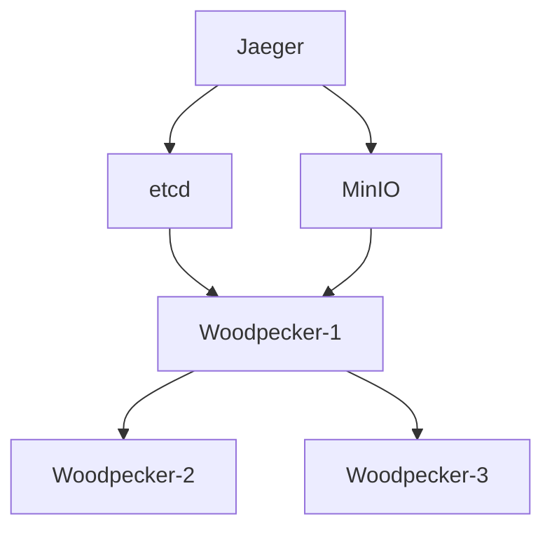

# Woodpecker Cluster Deployment

This directory contains the **official Docker Compose deployment** for running a complete Woodpecker cluster with all dependencies. This is the recommended way to deploy and test Woodpecker in development and production environments.

## Directory Structure

```
deployments/
├── deploy.sh           # Main deployment script with all commands
├── docker-compose.yaml # Complete cluster configuration
└── README.md          # This documentation
```

## Architecture

The cluster consists of:
- **3 Woodpecker nodes** with gossip-based discovery
- **etcd** for metadata storage and coordination  
- **MinIO** for object storage backend
- **Jaeger** for distributed tracing

## Quick Start

### 1. Build and Start Cluster

```bash
# From project root
cd deployments
./deploy.sh up
```

This single command will:
- Check if Woodpecker Docker image exists, build if needed
- Start all services using Docker Compose
- Set up the complete cluster with gossip-based discovery

### 2. Using Different Operating Systems

You can choose different base operating systems for Woodpecker nodes:

```bash
# Using Ubuntu 22.04 (default)
./deploy.sh up

# Using Amazon Linux 2023
WOODPECKER_IMAGE=woodpecker:amazonlinux2023 ./deploy.sh up

# Using Rocky Linux 8
WOODPECKER_IMAGE=woodpecker:rockylinux8 ./deploy.sh up

# Using Ubuntu 20.04
WOODPECKER_IMAGE=woodpecker:ubuntu20.04 ./deploy.sh up
```

Or create a `.env` file in the `deployments/` directory:
```bash
# .env file
WOODPECKER_IMAGE=woodpecker:amazonlinux2023
```

### 3. Access Services

- **Woodpecker gRPC APIs**:
  - Node 1: `localhost:18080`
  - Node 2: `localhost:18081` 
  - Node 3: `localhost:18082`
- **MinIO Console**: `http://localhost:9001` (minioadmin/minioadmin)
- **Jaeger UI**: `http://localhost:16686`
- **etcd**: `localhost:2379`

### 4. Check Status

```bash
./deploy.sh status
```

### 5. View Logs

```bash
./deploy.sh logs
```

### 6. Stop Cluster

```bash
./deploy.sh down
```

## Available Commands

| Command | Description |
|---------|-------------|
| `build` | Build Woodpecker Docker image |
| `up` | Start the complete cluster |
| `down` | Stop the cluster |
| `clean` | Stop cluster and remove volumes |
| `logs` | Show all service logs |
| `status` | Show cluster status |
| `test` | Run connectivity tests |
| `help` | Show help message |

## Configuration

The cluster uses the following configuration:

### Woodpecker Nodes
- **Storage Type**: `service` (staged storage with MinIO backend)
- **Gossip Discovery**: Node 1 is bootstrap, others join via seeds
- **Resource Groups**: Primary (nodes 1-2), Secondary (node 3)
- **Availability Zones**: az-1, az-2, az-3

### Environment Variables
Key environment variables can be overridden in `docker-compose.yaml`:

```yaml
- STORAGE_TYPE=service
- ETCD_ENDPOINTS=[etcd:2379]  # Now supports array format
- MINIO_ADDRESS=minio
- MINIO_ACCESS_KEY=minioadmin
- MINIO_SECRET_KEY=minioadmin
- LOG_LEVEL=info
- WAIT_FOR_DEPS=true
- DEP_TIMEOUT=120
```

## Development

### Building Binary
```bash
# Use the new build system for cross-platform builds
cd build
./build_bin.sh           # Auto-detect architecture
./build_bin.sh amd64     # Build for AMD64/x86-64
./build_bin.sh arm64     # Build for ARM64

# Build Docker images
./build_image.sh                          # Default ubuntu22.04
./build_image.sh ubuntu22.04 arm64        # Specific architecture
./build_image.sh ubuntu22.04 multiarch    # Multi-architecture
```

### Dockerfile
The Docker images are built from `build/docker/ubuntu22.04/Dockerfile`:
- Multi-architecture support (AMD64/ARM64)
- Minimal Ubuntu base image
- Go static binary compilation
- Built-in health checks and startup scripts
- Optimized for container environments

### Testing
```bash
# Test connectivity
./deploy.sh test

# Check cluster status
./deploy.sh status

# Manual health checks
docker exec woodpecker-node1 /woodpecker/bin/health-check.sh
nc -z localhost 17946  # Gossip port (may bind to container IP)
```

## Troubleshooting

### Service Not Starting
1. Check logs: `./deploy.sh logs`
2. Verify dependencies: `./deploy.sh status`
3. Clean and restart: `./deploy.sh clean && ./deploy.sh up`

### Port Conflicts
If ports are already in use, modify `docker-compose.yaml`:
```yaml
ports:
  - "19080:18080"  # Change external port to avoid conflicts
```

### Data Persistence
Data is stored in Docker volumes:
- `woodpecker1_data`, `woodpecker2_data`, `woodpecker3_data`
- `etcd_data`, `minio_data`

To reset all data: `./deploy.sh clean`

## Architecture Notes

### Network Configuration
All Woodpecker nodes use **bridge networking** with **advertise address configuration** to solve Docker network isolation:

| Node | gRPC Port | Gossip Port | Bind | Advertise | Access |
|------|-----------|-------------|------|-----------|--------|
| Node 1 | 18080 | 17946 | `0.0.0.0:18080` | `host.docker.internal:18080` | `localhost:18080` |
| Node 2 | 18081 | 17947 | `0.0.0.0:18081` | `host.docker.internal:18081` | `localhost:18081` |
| Node 3 | 18082 | 17948 | `0.0.0.0:18082` | `host.docker.internal:18082` | `localhost:18082` |

**Key Benefits**:
- ✅ **Network isolation**: Proper Docker container isolation maintained
- ✅ **Port mapping**: Traditional Docker port mapping `host:container`
- ✅ **Gossip compatibility**: `host.docker.internal` enables cross-container communication
- ✅ **Client transparency**: External clients use `localhost:port`, gossip uses advertise addresses

**Client Connection Example**:
```bash
# Connect to any node, gossip will provide full cluster topology
woodpecker-client --endpoint localhost:18080  # Node 1
# or
woodpecker-client --endpoint localhost:18081  # Node 2  
# or
woodpecker-client --endpoint localhost:18082  # Node 3
```

**Important Notes**:
- 🌐 **Bridge Network**: Woodpecker nodes use standard Docker bridge networking
- 🔗 **Advertise Address**: `host.docker.internal` enables container-to-host communication
- 📍 **Dual Address System**: 
  - **Bind**: `0.0.0.0:port` (listen on all container interfaces)
  - **Advertise**: `host.docker.internal:port` (tell other nodes how to reach us)
- 🎯 **Platform Support**: `host.docker.internal` works on Docker Desktop (Mac/Windows), use `host.docker.internal` or `172.17.0.1` on Linux

### Gossip Discovery
- Node 1 starts as bootstrap (no seeds)
- Node 2 joins via `SEEDS=host.docker.internal:17946`
- Node 3 joins via `SEEDS=host.docker.internal:17946,host.docker.internal:17947`

**How it works**:
1. **Container binding**: Each node binds to `0.0.0.0:gossip-port` inside the container
2. **Port mapping**: Docker maps container port to host port (e.g., `17946:17946`)
3. **Advertise configuration**: Nodes advertise `host.docker.internal:host-port` to peers
4. **External access**: Clients connect to `localhost:host-port`, gossip handles discovery

### Storage Backend
Uses staged storage (service mode):
- Local disk for hot data and caching
- MinIO for cold storage and durability
- Automatic data migration between tiers

### Service Dependencies
